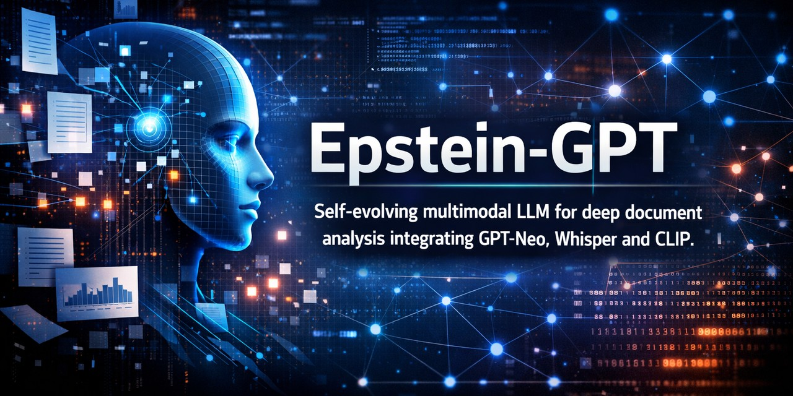

<p align="center">
  
</p>

# EpsteinGPT

EpsteinGPT is a self-hosted, epistemic large language model stack built around an EleutherAI GPT‑Neo 2.7B base model with:

- Online ingestion of public documents (JFK archives, OIG reports, etc.)
- Semantic deduplication using SentenceTransformers + FAISS
- Epistemic regularization loss for training
- FastAPI HTTP API exposing an OpenAI‑style `/chat/completions` endpoint
- Optional multimodal conditioning (images, audio, video) via CLIP and Whisper
- A simple Streamlit chat UI that talks to the FastAPI backend

This README describes how to install, configure, and run the full stack locally, and how to interact with it from the browser or from code.

---

## What EpsteinGPT is (non‑technical overview)

For non‑technical users, EpsteinGPT is a **local AI assistant** that you run on your own machine. Instead of sending data to a third‑party service, the model, database, and all processing stay under your control.

EpsteinGPT continuously pulls in public documents (such as declassified archives and government reports), cleans and deduplicates them, and uses them to inform its responses. It is designed to be *epistemic*—focused on sources, uncertainty, and evidence rather than just generating fluent text.

You can:

- Ask questions from a web chat interface (Streamlit) in your browser.
- Use a programmatic API (FastAPI) from your own tools or scripts.
- Optionally enable image, audio, and video understanding for richer queries.

---

## Why this project matters

EpsteinGPT explores what it looks like to build a **vertically integrated, self‑hosted research assistant** instead of depending on opaque cloud models.

Key aspects of significance:

- **Data provenance and authority**: The system tracks sources, local citation counts, and an authority score per document, enabling reasoning about “where a claim came from” and how trustworthy it might be.
- **Continuous ingestion and learning**: Ingestion and training loops enable the model to adapt over time to new public records and leaks, instead of relying on static snapshots.
- **Epistemic loss**: A custom loss term encourages the model not just to predict text, but to balance consistency, disagreement, and authority among sources.
- **Multimodal architecture**: With CLIP, Whisper, and a multimodal prefix module, the design supports conditioning on images, audio, and video in the same latent space as text.
- **Privacy and autonomy**: Running locally (or on controlled infrastructure) gives organizations and individuals more control over sensitive workflows than typical SaaS AI tools.

---

## Features

- **Causal LM backbone**
  - EleutherAI `gpt-neo-2.7B` via Hugging Face Transformers.

- **Training & checkpoints**
  - Streaming and static dataset support (`EpsteinDataset`, `StreamingEpsteinDataset`).
  - Epistemic loss combining cross‑entropy with a regularization term.
  - Checkpointing every N steps with metadata logging to SQLite (`runs`, `steps` tables).

- **Ingestion pipeline**
  - Crawls configured public archives (`archives.gov`, `justice.gov`, `governmentattic.org`, etc.).
  - Extracts text from PDFs, images (OCR), JSON, and common formats.
  - Semantic deduplication with SentenceTransformers + FAISS index.
  - Document registry in SQLite (`docs` table with path, hash, timestamps).

- **Epistemic metadata and authority scoring**
  - Heuristics to estimate citation density (patterns like “v.”, “U.S.C.”, “case no.”).
  - Authority scoring by source type (gov, court, media, unknown) and citation statistics.

- **Multimodal encoders (optional)**
  - Image encoder: CLIP (`openai/clip-vit-base-patch32`).
  - Audio encoder: Whisper (`openai/whisper-small`).
  - Video encoder: CLIP on sampled frames.
  - `MultimodalPrefix` projecting embeddings into LM hidden space and fusing them as a conditioning prefix.

- **FastAPI backend**
  - `POST /chat/completions?session_id=default` with OpenAI‑style request/response models.
  - Session‑aware `ChatEngine` storing conversation history per session ID.
  - Optional debug metadata in responses (e.g., which modalities were used).

- **Streamlit frontend**
  - Chat UI using `st.chat_message` and `st.chat_input`.
  - Sends OpenAI‑style JSON payloads and displays multi‑part text responses.

---

## Requirements

- Python 3.10+ (recommended).
- CPU with sufficient RAM for a 2.7B parameter model; GPU strongly recommended for interactive latency.
- System dependencies:
  - Tesseract OCR (for `pytesseract`).
  - Ghostscript / poppler or equivalent for `pdf2image` (platform‑specific).

Python packages (install via `pip`):

```bash
pip install \
  torch transformers sentence-transformers faiss-cpu \
  fastapi uvicorn pydantic \
  streamlit requests \
  beautifulsoup4 PyPDF2 pdf2image pytesseract Pillow \
  torchaudio opencv-python
```

Adjust `faiss-cpu` to a GPU‑enabled FAISS build if desired.

---

## Project structure

Core files and directories:

- `EpsteinGPT.py` – initial single‑file implementation with API and training.
- `EpsteinGPTv2.py` – updated multimodal‑aware version with enhanced chat response structure and post‑processing.
- `app.py` – Streamlit chat frontend (see below).
- `.epsteinfiles/` – ingestion corpus directory (auto‑created).
- `.checkpoints/` – checkpoint files (`.pt`) written by the training manager.
- `.mediacache/` – cached embeddings for media to avoid recomputation.
- `.epsteingpt.db` – SQLite database for runs, steps, docs, and events.

Configuration is embedded in the `Config` class inside `EpsteinGPT.py` / `EpsteinGPTv2.py`.

---

## Configuration

Key `Config` fields (non‑exhaustive):

- **Model & training**
  - `basemodel = "EleutherAI/gpt-neo-2.7B"`
  - `device = "cuda" if torch.cuda.is_available() else "cpu"`
  - `maxlen`, `stride`, `batchsize`, `epochs`, `lr`, `warmupratio`, `weightdecay`, `maxgradnorm`

- **Epistemic loss**
  - `numroots`, `lambdareg`, `sigmaa`, `sigmah`, `alphabase`, `rhobase`, `totalstepscap`

- **Ingestion**
  - `ingestionintervalsec`
  - `keywords`
  - `publicarchives`
  - `maxnewdocspercycle`

- **Deduplication**
  - `embeddingmodelname`
  - `dedupindexpath`
  - `dedupmetapath`
  - `dedupthreshold`

- **Checkpoints & DB**
  - `checkpointdir`, `checkpointeverysteps`
  - `metadatastorepath`, `metadatalogpath`
  - `dbpath`

- **Supervisor**
  - `supervisorintervalsec`, `maxdiskusageratio`, `maxcheckpointstokeep`

- **API & UI behavior**
  - `apihost = "0.0.0.0"`
  - `apiport = 8000`
  - `enableapi = True`
  - `enablestreaming` (reserved)
  - `maxuploadmb`
  - `safemodedefault`

- **Media cache & answers**
  - `mediacachedir`, `reusecachedembeddings`
  - `maxsummarychars`, `maxsummarybullets`

Modify `Config` to fit your environment before running.

---

## Running the backend

Launch the full stack by running `EpsteinGPTv2.py`:

```bash
python EpsteinGPTv2.py
```

On startup, it will:

- Initialize the SQLite database and metadata store.
- Load the base model and tokenizer.
- Optionally restore from the latest good checkpoint.
- Start ingestion, training, supervisor, and API threads (if enabled in `Config`).

Console output example:

```text
EpsteinGPT ready. Type 'help' for commands, 'exit' to quit.
INFO:     Started server process [PID]
INFO:     Waiting for application startup.
INFO:     Application startup complete.
INFO:     Uvicorn running on http://0.0.0.0:8000 (Press CTRL+C to quit)
```

### REPL commands

In the same terminal, you can interact with the local REPL:

- `status` – show last run ID, last step, latest loss, and doc count.
- `runs` – list recent runs with timestamps and status.
- `pause` – request training pause.
- `resume` – resume training in a new thread.
- `help` – list commands.
- Any other input – sent as a prompt directly to the model for an immediate response.

Note: first responses after startup may be slow while the model and supporting components warm up. Subsequent responses are typically faster.

---

## API: `/chat/completions`

### Request format

Endpoint:

```text
POST /chat/completions?session_id={session_id}
```

Body (JSON) conforms to `ChatRequest`:

```json
{
  "model": "epsteingpt",
  "messages": [
    {
      "role": "system",
      "content": [
        {
          "type": "text",
          "text": "You are EpsteinGPT, an epistemic AI assistant."
        }
      ]
    },
    {
      "role": "user",
      "content": [
        {
          "type": "text",
          "text": "Hello"
        }
      ]
    }
  ],
  "temperature": 0.7,
  "top_p": 0.9,
  "max_tokens": 256,
  "stream": false
}
```

Rules:

- `messages` must be non‑empty.
- Each message:
  - `role` in `"user"`, `"assistant"`, `"system"`.
  - `content` is a list of parts.
- Text parts: `{ "type": "text", "text": "..." }`
- The last message’s `role` **must** be `"user"` or `"system"`; otherwise the server returns `400 Bad Request`.
- `session_id` controls which server‑side history buffer is used.

Example curl:

```bash
curl -X POST "http://localhost:8000/chat/completions?session_id=default" \
  -H "Content-Type: application/json" \
  -d "{\"model\":\"epsteingpt\",\"messages\":[{\"role\":\"user\",\"content\":[{\"type\":\"text\",\"text\":\"Hello\"}]}],\"temperature\":0.7,\"top_p\":0.9,\"max_tokens\":64,\"stream\":false}"
```

### Response format

`ChatResponse` example:

```json
{
  "id": "chatcmpl-1739976000000",
  "object": "chat.completion",
  "created": 1739976000,
  "model": "epsteingpt",
  "choices": [
    {
      "index": 0,
      "message": {
        "role": "assistant",
        "content": [
          {
            "type": "text",
            "text": "Hello! How can I help you today?"
          }
        ],
        "debug": {
          "image_encoded": false,
          "audio_encoded": false,
          "video_encoded": false
        }
      },
      "finish_reason": "stop"
    }
  ]
}
```

Typical client logic:

- Take `choices[0].message`.
- Iterate `message["content"]`.
- Concatenate `part["text"]` for all parts where `part["type"] == "text"`.

---

## Streamlit chat app (for non‑technical users)

For non‑technical users, the easiest way to use EpsteinGPT is via a simple chat interface in your browser.

### Step 1: Create `app.py`

Place this file in the same directory as `EpsteinGPTv2.py`:

```python
import json
import time
from typing import List, Dict, Any

import requests
import streamlit as st


# ---------- Core config ----------

API_URL = "http://localhost:8000/chat/completions"
SESSION_ID = "default"
REQUEST_TIMEOUT = 300  # seconds
MAX_HISTORY_MESSAGES = 10  # keep last N turns for latency


# ---------- Page config & global styling ----------

st.set_page_config(
    page_title="EpsteinGPT – SynthicSoft Labs",
    page_icon="🧠",
    layout="wide",
)

# Global theming / layout tweaks
st.markdown(
    """
    <style>
    .main {
        background: radial-gradient(circle at top left, #1f2937 0, #020617 55%);
        color: #e5e7eb;
    }
    /* Hide default padding at the top */
    .block-container {
        padding-top: 1rem;
        padding-bottom: 1.5rem;
        max-width: 1100px;
    }
    .synthic-header {
        padding: 0.5rem 0 1.25rem 0;
        border-bottom: 1px solid rgba(148, 163, 184, 0.25);
        margin-bottom: 0.5rem;
    }
    .synthic-header h1 {
        font-size: 1.8rem;
        margin-bottom: 0.25rem;
        display: flex;
        align-items: center;
        gap: 0.5rem;
    }
    .synthic-header h1 span.logo {
        font-size: 1.9rem;
    }
    .synthic-header p {
        font-size: 0.9rem;
        color: #9ca3af;
        margin: 0;
    }
    .pill {
        display: inline-flex;
        align-items: center;
        gap: 0.25rem;
        font-size: 0.75rem;
        padding: 0.15rem 0.6rem;
        border-radius: 999px;
        border: 1px solid rgba(148, 163, 184, 0.35);
        color: #9ca3af;
        margin-right: 0.35rem;
    }
    .synthic-footer {
        margin-top: 1.5rem;
        font-size: 0.8rem;
        color: #6b7280;
        border-top: 1px solid rgba(148, 163, 184, 0.25);
        padding-top: 0.6rem;
    }
    .synthic-footer a {
        color: #93c5fd;
        text-decoration: none;
    }
    .synthic-footer a:hover {
        text-decoration: underline;
    }
    /* Chat tweaks */
    .stChatMessage {
        font-size: 0.95rem;
        line-height: 1.55;
    }
    .st-emotion-cache-1r6slb0 {  /* chat input container */
        border-top: 1px solid rgba(148, 163, 184, 0.35);
        padding-top: 0.5rem;
    }
    </style>
    """,
    unsafe_allow_html=True,
)

st.markdown(
    """
    <div class="synthic-header">
      <h1><span class="logo">🧠</span> EpsteinGPT</h1>
      <p>by SynthicSoft Labs · Local-first epistemic assistant over public archives</p>
      <div style="margin-top:0.3rem;">
        <span class="pill">alpha · research build</span>
        <span class="pill">offline-friendly</span>
        <span class="pill">open source</span>
      </div>
    </div>
    """,
    unsafe_allow_html=True,
)


# ---------- Sidebar: branding, persona, and controls ----------

if "temperature" not in st.session_state:
    st.session_state.temperature = 0.7
if "max_tokens" not in st.session_state:
    st.session_state.max_tokens = 256
if "persona" not in st.session_state:
    st.session_state.persona = "Epistemic analyst"

with st.sidebar:
    st.markdown("### SynthicSoft Labs")
    st.markdown(
        "Local‑first, security‑focused AI tooling, built for practitioners.\n\n"
        "[🌐 Website](https://synthicsoftlabs.com)"
    )

    st.markdown("---")
    st.markdown("#### Assistant style")

    persona = st.selectbox(
        "Persona",
        [
            "Epistemic analyst",
            "Dry researcher",
            "Explainer for non‑technical users",
            "Custom",
        ],
        index=["Epistemic analyst", "Dry researcher",
               "Explainer for non‑technical users", "Custom"].index(st.session_state.persona)
        if st.session_state.persona in [
            "Epistemic analyst",
            "Dry researcher",
            "Explainer for non‑technical users",
            "Custom",
        ]
        else 0,
    )
    st.session_state.persona = persona

    custom_system_prompt = ""
    if persona == "Epistemic analyst":
        system_prompt = (
            "You are EpsteinGPT, an epistemic analyst over public archives. "
            "You reason step by step, call out uncertainty, and avoid listing specific "
            "real-world individuals as criminals unless quoting well-documented public records."
        )
    elif persona == "Dry researcher":
        system_prompt = (
            "You are EpsteinGPT, a dry, technical research assistant. "
            "You answer concisely in neutral tone, always noting limitations and uncertainty."
        )
    elif persona == "Explainer for non‑technical users":
        system_prompt = (
            "You are EpsteinGPT, an explainer for non‑technical users. "
            "You use plain language, short paragraphs, and concrete examples when helpful."
        )
    else:  # Custom
        custom_system_prompt = st.text_area(
            "Custom system prompt",
            value=st.session_state.get(
                "custom_system_prompt_value",
                "You are EpsteinGPT, a helpful local research assistant.",
            ),
            height=120,
        )
        st.session_state.custom_system_prompt_value = custom_system_prompt
        system_prompt = custom_system_prompt or (
            "You are EpsteinGPT, a helpful local research assistant."
        )

    st.markdown("---")
    st.markdown("#### Generation")

    st.session_state.temperature = st.slider(
        "Temperature", 0.0, 1.0, st.session_state.temperature, 0.05
    )
    st.session_state.max_tokens = st.slider(
        "Max response tokens", 32, 512, st.session_state.max_tokens, 16
    )

    fast_mode = st.checkbox("Fast mode (shorter answers)", value=True)
    st.session_state.fast_mode = fast_mode

    st.markdown("#### Session")
    if st.button("🧹 Clear conversation"):
        st.session_state.messages = []
        st.experimental_rerun()


# ---------- Backend helpers ----------

def build_backend_messages(history: List[Dict[str, str]]) -> List[Dict[str, Any]]:
    """
    Convert Streamlit chat history into the backend ChatMessage format:
    {
      "role": "user" | "assistant" | "system",
      "content": [{"type": "text", "text": "..."}]
    }
    """
    backend_messages: List[Dict[str, Any]] = []

    # System message from selected persona
    backend_messages.append(
        {
            "role": "system",
            "content": [{"type": "text", "text": system_prompt}],
        }
    )

    for msg in history:
        role = msg["role"]
        if role not in ("user", "assistant", "system"):
            role = "system"

        backend_messages.append(
            {
                "role": role,
                "content": [
                    {
                        "type": "text",
                        "text": msg["content"],
                    }
                ],
            }
        )
    return backend_messages


def call_backend(history: List[Dict[str, str]]) -> str:
    """
    Sends (truncated) history to the backend and returns cleaned assistant text.

    - Limits history length for latency.
    - Prefers main raw answer and optional 'Summary:' line.
    - Skips 'Key points:' blocks.
    - Adds simple safety/quality guards.
    """
    short_history = history[-MAX_HISTORY_MESSAGES:]
    messages = build_backend_messages(short_history)

    # Backend requires last message role to be user or system
    if not messages or messages[-1]["role"] not in ("user", "system"):
        raise ValueError("Last message must be user or system for backend request.")

    max_tokens = st.session_state.get("max_tokens", 256)
    if st.session_state.get("fast_mode", False):
        max_tokens = min(max_tokens, 160)

    payload: Dict[str, Any] = {
        "model": "epsteingpt",
        "messages": messages,
        "temperature": st.session_state.get("temperature", 0.7),
        "top_p": 0.9,
        "max_tokens": max_tokens,
        "stream": False,
    }

    response = requests.post(
        f"{API_URL}?session_id={SESSION_ID}",
        json=payload,
        timeout=REQUEST_TIMEOUT,
    )
    response.raise_for_status()

    data = response.json()
    choices = data.get("choices", [])
    if not choices:
        raise ValueError(f"No choices in backend response: {json.dumps(data)[:400]}")

    message = choices[0].get("message", {})
    parts = message.get("content", [])

    raw = None
    summary = None

    # Extract main answer and optional summary; skip key points and noise
    for part in parts:
        if not isinstance(part, dict):
            continue
        if part.get("type") != "text":
            continue

        text = (part.get("text") or "").strip()
        if not text:
            continue

        if text.startswith("Summary:"):
            summary = text
        elif text.startswith("Key points:"):
            # Skip key points in the main chat display for now
            continue
        else:
            # First non-summary, non-key-points text is treated as main answer
            if raw is None:
                raw = text

    # Fallback: if we didn't find a clear raw answer, join all text parts
    if raw is None:
        texts: List[str] = []
        for part in parts:
            if isinstance(part, dict) and part.get("type") == "text":
                t = (part.get("text") or "").strip()
                if t:
                    texts.append(t)
        if not texts:
            return json.dumps(message, ensure_ascii=False)
        raw = "\n\n".join(texts)

    raw = raw.strip()

    # --- Basic quality filters for obviously bad answers ---

    user_last = history[-1]["content"].strip().lower() if history else ""

    # If the user asked "who ..." and the answer is tiny (e.g. "yes.")
    if user_last.startswith("who ") and len(raw) < 20:
        return (
            "I’m not able to provide a reliable list of specific names from the Epstein "
            "files in this local model snapshot. You should consult primary sources and "
            "verified reporting for that question."
        )

    # If the answer looks like a random transcript (speaker tags in all caps + colon)
    if any(token.endswith(":") and token.isupper() for token in raw.split()):
        return (
            "The model drifted into unrelated transcript-like text instead of answering "
            "your question clearly. Please rephrase or narrow your question."
        )

    if summary:
        return raw + "\n\n\n" + summary.strip()

    return raw


# ---------- Chat UI ----------

if "messages" not in st.session_state:
    # Each message: {"role": "user" | "assistant" | "system", "content": str}
    st.session_state.messages: List[Dict[str, str]] = []
    st.markdown(
        "#### Welcome\n"
        "_EpsteinGPT is an experimental, local‑first research assistant. Responses may be slow and should be independently verified._"
    )

# Render existing history
for msg in st.session_state.messages:
    role = msg["role"]
    if role not in ("user", "assistant"):
        role = "assistant"
    avatar = "🧑‍💻" if role == "user" else "🧠"
    with st.chat_message(role, avatar=avatar):
        st.markdown(msg["content"])

# Input from user
user_text = st.chat_input("Ask EpsteinGPT anything about the public archives…")

if user_text:
    # Store user message
    st.session_state.messages.append({"role": "user", "content": user_text})

    # Display user message immediately
    with st.chat_message("user", avatar="🧑‍💻"):
        st.markdown(user_text)

    # Backend call + assistant rendering
    with st.chat_message("assistant", avatar="🧠"):
        with st.spinner("EpsteinGPT is thinking…"):
            start = time.time()
            try:
                assistant_text = call_backend(st.session_state.messages)
                elapsed = time.time() - start

                # Streaming façade for better UX
                placeholder = st.empty()
                buffer = ""
                words = assistant_text.split(" ")
                # Speed up if answer is long
                delay = 0.02 if len(words) < 120 else 0.0

                for chunk in words:
                    buffer += chunk + " "
                    placeholder.markdown(buffer + "▌")
                    if delay > 0:
                        time.sleep(delay)
                placeholder.markdown(buffer)

                # Persist in history
                st.session_state.messages.append(
                    {"role": "assistant", "content": assistant_text}
                )

                # Latency + mode info
                mode_label = "fast" if st.session_state.get("fast_mode", False) else "deep"
                st.caption(
                    f"Response time: {elapsed:.2f} s · mode: {mode_label} · "
                    f"T={st.session_state.temperature:.2f}, max_tokens={st.session_state.max_tokens}"
                )

            except requests.HTTPError as http_err:
                status = http_err.response.status_code
                try:
                    err_body = http_err.response.json()
                    err_text = json.dumps(err_body, ensure_ascii=False)
                except Exception:
                    err_text = http_err.response.text[:400]
                st.error(f"Backend HTTP {status}: {err_text}")

            except Exception as e:
                st.error(f"Client error: {e}")


# ---------- Footer ----------

st.markdown(
    """
    <div class="synthic-footer">
      EpsteinGPT is an experimental open-source research system from SynthicSoft Labs.
      Learn more at <a href="https://synthicsoftlabs.com" target="_blank">synthicsoftlabs.com</a>.
    </div>
    """,
    unsafe_allow_html=True,
)

```

### Step 2: Start the backend

In one terminal:

```bash
python EpsteinGPTv2.py
```

Wait until you see “Application startup complete” and the Uvicorn line with port 8000.

### Step 3: Start the chat app

In another terminal:

```bash
streamlit run app.py
```

Your browser will open (or you can navigate to `http://localhost:8501`). You should see a chat window titled “EpsteinGPT”. Type “hello” and press Enter. The first answer may take some time; later exchanges are usually faster.

---

## Multimodal usage (advanced)

The Chat API supports image, audio, and video parts using URL references.

- Image:

  ```json
  {
    "type": "image_url",
    "image_url": {
      "url": "https://example.com/image.png",
      "detail": "high"
    }
  }
  ```

- Audio:

  ```json
  {
    "type": "audio_url",
    "audio_url": {
      "url": "https://example.com/audio.wav"
    }
  }
  ```

- Video:

  ```json
  {
    "type": "video_url",
    "video_url": {
      "url": "https://example.com/video.mp4"
    }
  }
  ```

When present in the last user message, the backend will:

- Download the referenced media (up to `maxuploadmb` megabytes).
- Compute modality‑specific embeddings via `ImageEncoder`, `AudioEncoder`, or `VideoEncoder`.
- Fuse them with text via `MultimodalPrefix` and call `model.generate` with `inputs_embeds`.

This can increase compute and latency, so start with text‑only usage if you are on a limited machine.

---

## Ingestion and training internals (technical users)

- **Ingestion loop** (`continuous_ingestion_loop`):
  - Periodically fetches new URLs from configured archives.
  - Filters by extension and keywords.
  - Downloads, extracts text, deduplicates, and stores metadata plus content hash.

- **Semantic dedup** (`SemanticDeduper`):
  - Uses SentenceTransformers to embed text.
  - FAISS index for similarity.
  - Threshold‑based duplicate detection and incremental index writes.

- **Training managers** (`TrainingManager`, `TrainingManagerAMP`):
  - Use either standard or AMP training loops.
  - Sample source metadata to feed into the epistemic loss.
  - Write steps and checkpoints and update the `runs` table.

- **Supervisor** (`Supervisor`):
  - Monitors latest loss, disk usage, and GPU memory.
  - Enforces maximum checkpoint count and logs health events.

These components are enabled by default but can be selectively disabled by commenting out their thread starts at the bottom of `EpsteinGPTv2.py` for a lean inference‑only setup.

---

## Troubleshooting

- **Streamlit never returns (“EpsteinGPT is thinking...”)**
  - Check the backend logs for `POST /chat/completions`. If no request shows up, verify `API_URL` in `app.py`.
  - If the POST appears but there is no response, the model may still be warming up or `generate` is slow for your hardware; try reducing `max_tokens` in the client payload.

- **HTTP 400 from `/chat/completions`**
  - Ensure `messages` is non‑empty and that the last `role` is `"user"` or `"system"`.
  - Confirm each message has `content` as a list with at least one `"type": "text"` part containing non‑empty text.

- **High memory / disk usage**
  - Decrease batch size, `maxlen`, and `epochs` in `Config`.
  - Consider disabling training and/or ingestion threads if you only need inference.

- **OCR or PDF issues**
  - Verify system installs for `tesseract` and PDF rendering.
  - Check that `pdf2image` and `pytesseract` run successfully on sample files.

---

## Author

- **Author**: Adam Rivers  
- **Role**: CEO, SynthicSoft Labs  
- **Website**: https://synthicsoftlabs.com  

---

## Disclaimer

EpsteinGPT is an experimental research system. It is **not** a product, and it comes with **no warranty or guarantee of accuracy**.

- The model can hallucinate, misinterpret documents, and produce incorrect or misleading answers.
- Ingestion sources include public archives and reports; their presence in the corpus does not imply endorsement or verification.
- This stack is **not** intended for medical, legal, financial, or safety‑critical decision making.
- You are responsible for complying with all relevant laws, regulations, and third‑party model/data licenses when running or modifying this code.

Use EpsteinGPT at your own risk and always independently verify important information against primary sources.
